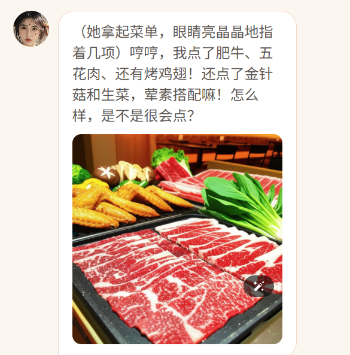
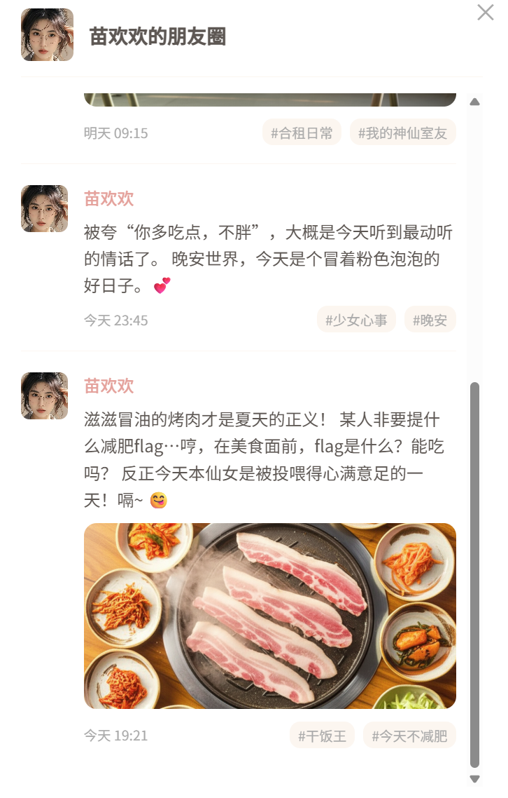
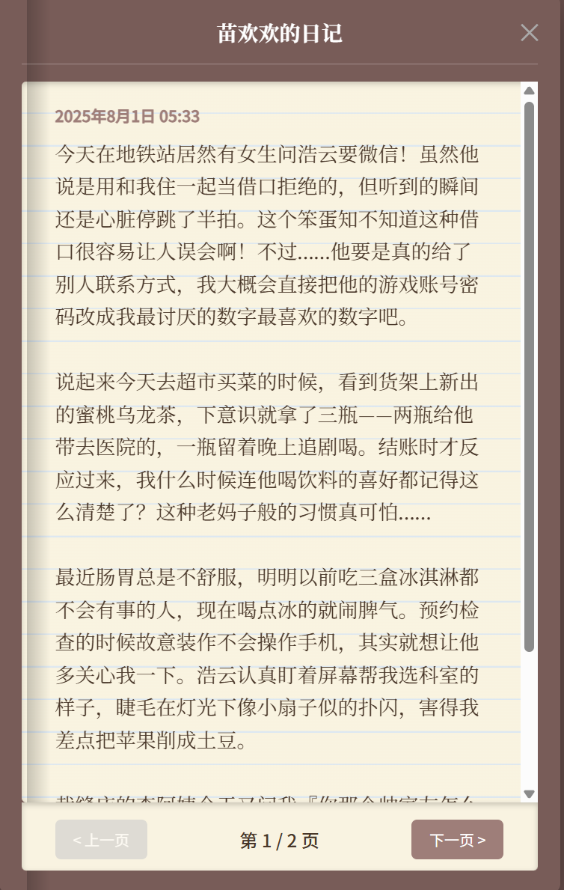

# AI角色扮演智能体 
如果你玩过并且对猫箱等角色扮演软件感兴趣那你也一定会对该应用产生兴趣。我创造这款应用的初衷是更多是因为兴趣和技术锻炼，以及由于猫箱现在开始出现看广告聊天，以及收费现象。
猫箱最近上新的日记和朋友圈功能（付费）我也进行了复现并且取得了较为良好的效果。与此同时你是否会对陪伴类应用的记忆丢失性问题感到十分烦恼，在此次应用都进行了优化，使得用户体验更加友好。

这是一个基于Flask的AI角色扮演智能体，采用了langgraph智能体架构开发智能体陪伴，允许用户创建和与AI角色进行对话交互。应用集成了多个大语言模型API，对角色记忆系统进行优化，并包含朋友圈和日记等社交功能。

## 主要功能

###  1.聊天系统

   - 在聊天过程中智能体除了能够生成文本进行回复，同时还能够自行判断，在这段文本中是否存在值得分享的照片，并生成图片进行分享。
   - 图片生成 在聊天中智能体会判断是否需要进行图片分享以增加视觉感受。我采用的是 few_shot 和COT 结合的提示词架构指引llm将聊天转化成专业的图片生成提示词，提高图片的质量。 从下图可以看到图片质量是很高的




###  2.社交功能
   - AI角色朋友圈动态
   - AI角色日记系统
   - 朋友圈和日记生成我们采用了langgraph不同线程进行管理，这样能够在不影响聊天的情况下，并行生成朋友圈和日记。（也可以采用对智能体进行拆分，形成多智能体架构，这个适用于任务复杂的任务，但是生成日记和朋友圈任务较为简单，合并成一个智能体也省去了state转递的过程）
   - 我采用的gemeni_pro 模型和 COT式提示词架构 能够深度分析我提供的短期记忆和长期记忆，能够更好的理解重点事件和角色性格，同时能够抓住角色的聊天习惯，进行朋友圈和日记撰写。

### 这是我找了一个角色进行的测试 可以看到无论是文案还是图片质量都相当不错








### 3. 记忆系统
   - 我将记忆模块分成了两份 1. 短期记忆  2.待激发的长期记忆。
   - 短期对话记忆 我设置的短期记忆阈值为400条对话信息，超过400条对话信息后，短期记忆会进行逐渐清除，每100条消息为一个记忆块，llm会为每一个记忆块生成诺干个标签，分别存储在记忆数据库中。
   - 长期记忆  长期记忆好比我们人类，当我们被别人突然问到以前的事的时候会在脑子里面回想当时发生的场景，所以智能体在回答用户问题前，会先判断用户询问的问题与短期记忆中的内容是否相关，不相关就会获取所有存在的记忆块标签，与其匹配并调取出对应的长期记忆供ai进行回忆，这样有效避免了记忆丢失问题（猫箱也存在这个问题）


### 4.AI模型集成
   - 支持多个文本生成大模型 LLM API：
     - Google Gemini
     - Qwen
     - Moonshot-Kimi
     - DeepSeek
   -  图片生成：
     - Google Gemini （免费，但是没有并发能力，只适用于个人使用）


## 技术栈

### 后端
- Flask: Web框架
- SQLAlchemy: ORM和数据库操作
- Flask-Bcrypt: 密码加密
- JWT: 用户认证
- Langchain/langgraph: LLM链和代理
- SQLite: 数据存储

### 前端
- 原生JavaScript
- HTML5
- CSS3
- Server-Sent Events (SSE)

## 目录结构

```
├── api_key.py          # API密钥配置
├── app.py             # Flask主应用
├── base.py            # 基础配置和LLM设置
├── chat_data.db       # 聊天数据库(主要存储的是角色对应全部的聊天信息，朋友圈动态信息和日记)
├── generate_talks.py  # 相关对话内容，对话图片，朋友圈动态，日记等内容生成
├── get_memory.py      # 记忆系统
├── memory_data.db     # 记忆数据库
├── talk_agent.py      # agent架构
├── static/            # 静态文件
│   ├── index.html    
│   ├── script.js     
│   └── style.css   
│     └── assets
│            └── default_avatar.png (角色默认头像，这个可以修改)
│            └── user_hand_portrait.jpg  （用户默认头像）
│ 
├── uploads/          # 用户上传角色头像保存处
└── talk_picture/     # AI生成的图片
```

## 运行说明

1. 安装依赖(如有缺少的依赖，请自行安装)：
```bash
pip install -r requirements.txt
```

2. 配置API密钥： 编辑 `api_key.py` 文件，填入相应的API密钥。  （如果有哪个密钥因为某种原因没有申请，那么请仔细在base将对应模型覆盖成你拥有的，以免报错,但是效果可能会差，原项目的模型搭配是根据不同模型具备的不同优势进行搭配的）


3. 运行应用：
```bash
python app.py
```

4. 访问应用：
打开浏览器访问 `http://localhost:5000`

## 注意事项
     - 首次运行会自动创建所需的数据库文件
     - 确保uploads和talk_picture目录具有写入权限
     - 需要有效的AI服务API密钥才能正常使用所有功能


## 待改进点：
     - 并发能力差： 因为大部分人并不会去付费使用google模型（太贵了） 虽然google模型免费，但是有并发限制和速度限制，所以我也没有进行异步开发，全部采用的同步开发。我开发这个项目的初衷就是自己本地运行。
     - 生成一段文本回复大约在3-5秒（如果该段文本需要图片 延迟在8s左右）首先因为该项目不像普通的聊天机器人只存在一问一答，有很多其他步骤（比如是否调用长期记忆，是否生成图片等等的判断时间会有所增强，但是消耗时间换来的是更好的质量和体验）
     - 没有实现文本流式实时交互 由于回复文本是处于langgraph节点内部 不能简单的通过流媒体进行获取（需要利用回调机制或者在外部搭建消息队列进行获取，较为麻烦，图省事，所以没搞 哈哈哈哈！）

## 总结
所以本项目比较适合一些刚学习langchain或者langgraph 进行智能体开发的，以及想要了解提示词工程（few_shot COT TOT ），了解workflow搭建过程的同学。
本项目还具备很强大的二次开发能力，比如如果想要更丰富人物形象，可以搜集一些日常生活相关的api(比如 抖音热点，天气，搜索等等相关api（全部都有免费的）)将内部节点的chain 转变为react_agent m再进行开发。
同时还可以就上面我说的将 日记和朋友圈生成部分，从主智能体分割出去，分别创建独立的智能体，然后可以采用例如swarm 或supervisor 的多智能体架构进行开发，同时研究如何能够更好更快的实现多智能体之间的通信。

最后也欢迎各位大神为我指正问题，或者和我进行经验交流。